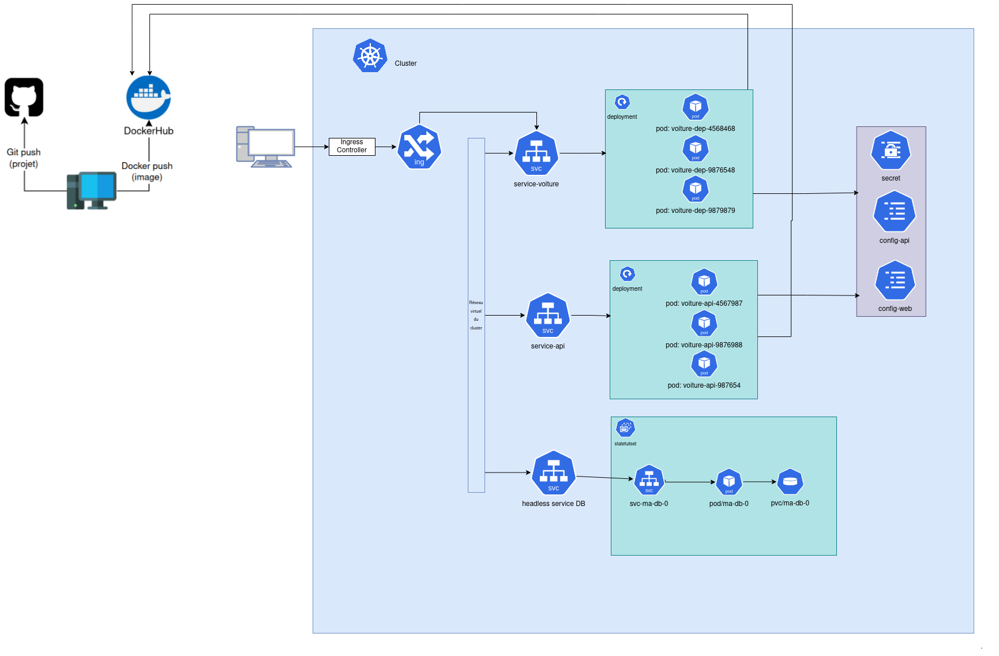

# Organisation par défi :
Chaque défi dispose de son propre dossier (ch1/, ch2/, etc.).
Chaque dossier de challenge inclut un README.md expliquant les étapes, les configurations utilisées et les schémas.

# Schéma


# commande utile
```
monkube delete all --all
monkube get pvc
monkube delete pvc/...

```


# BDD
<div align="center" style="width: 70%;">
    
</div>
