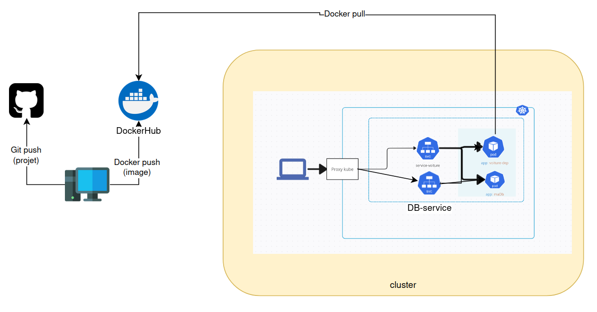

# étape 1: Création et Publication d'une Image Docker pour l’Application Django
```
docker build -t ssdev1254/voiture:v3 .

docker login

docker push ssdev1254/voiture:v3

```
# Questions

# Quelle est la différence entre un service ClusterIP et NodePort ?
Les deux sont une solution pour la non stabilité des IP des pods, et donc pour permettre d'accéder au pods. La différence entre les deux se base sur : 
L'ouverture : NodePort peut permettre à la fois d'exposer le port dans le cluster et à l'exterieur du cluster. ClusterIP crée une IP virtuelle et permet uniquement un accés interne. 

# Quelle critique pouvez-vous donner vis-à-vis de l'utilisation d'un Pod pour la base de données ?
L'utilisation d'un pod pour la base de données, notamment sans volumes, peut présenter des risques pour la cohérence des données. Un pod est éphémère et peut donc être supprimé à tout moment. Il est donc nécessaire d'utiliser un volume pour la base de données si elle est hébergée dans un pod, afin de garantir la persistance des données. Il est également préférable d'héberger la base de données sur un service dédié, car les clusters d'applications peuvent être piratés. Si la base de données se trouve sur un autre système, le hacker n’aura pas un accès direct.

Exemple de problème : Si on utilise une réplique de 3, la base de données ne sera pas synchronisée entre les pods. Tout dépend alors du load balancer du service : si celui-ci redirige vers un pod spécifique et que cet utilisateur est créé, cet utilisateur ne sera pas disponible sur les deux autres pods.

# Sur quel type de ressource KubeDNS crée des entrées ? Quelle information propre a la ressource est utilisée ?

KubeDNS qui est en charge de créer des entrées DNS dans kubernetes, s'occupe de la mise en place des entrées pour les ressources du type Service principalement que ce soit simple ou headless, il peut le faire pour d'autres ressources mais c'est pas une bonne pratique


L'information principale utilisée est le nom du service et le nom du namespace. Kubernetes s'occupe de la résolution de l'adresse IP du service à partir de son nom. Ensuite, c'est le service qui redirige vers les pods en utilisant les labels des pods. Pour les services headless, ce sont les labels qui sont utilisés pour pointer directement vers les pods.

# Le schéma !





# acceder au site en locale 
```
monkube proxy

http://127.0.0.1:8001/api/v1/namespaces/u-9nl7s/services/voiture-svc/proxy/
```


## commandes utiles  
```
docker compose up --build

docker run yzriga/todo_list_project:v1

monkube delete deployments/voiture-dep

monkube delete deployments/ma-db

monkube delete services/db

monkube delete services/todo-list-service

monkube delete services/mon-dep-service

monkube get deployments
monkube get services


monkube apply -f dep-db.yml
monkube apply -f deployment.yaml
monkube apply -f service-db.yml
monkube apply -f service.yaml
```


```

docker build -t yzriga/voiture:v1 .

docker login

docker push yzriga/voiture:v1


docker build -t ssdev1254/voiture:v1 .

docker login

docker push ssdev1254/voiture:v1

```
# étape 2: Déployer le site Django dans un Pod

```
monkube apply -f deployment.yaml

monkube apply -f service.yaml

monkube get pods

monkube logs deployments/voiture-dep > log.log

```