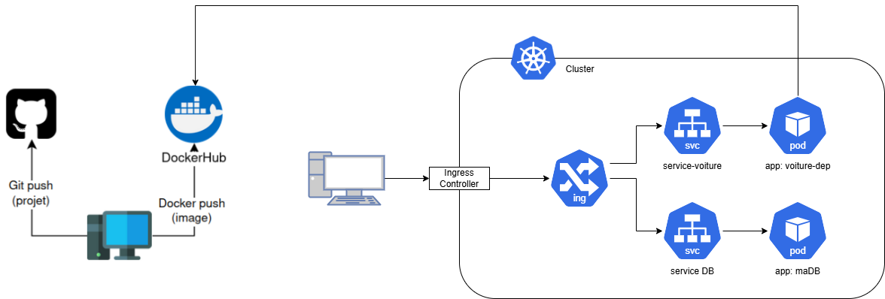

# Objectif

Faire en sorte que notre site soit accessible à l'adresse suivante :

```
https://django.aayyss.csc8567.luxbulb.org/ 

```


# Création de l'Ingress

Décrire la procédure de création de l'Ingress

1) Créer un fichier yaml pour deployer le pod Ingress:
- définir dans le fichier le nom du domaine pour aller au site web et le port
- pointer vers le service web que l'on a crée précédemment
- définir une spécification TLS pour accéder au site en HTTPS

2) Créer des certificats TLS:
```
sudo apt update
sudo apt install openssl
```

# definition des variables
```
export KEY_FILE="tls.key"
export CERT_FILE="tls.crt"
export HOST="django.aayyss.csc8567.luxbulb.org"
export CERT_NAME=secret
```

# Pour créer le certificat TLS, le fichier de la clé et le mot secret qu'on va utiliser
```
monkube create secret tls ${CERT_NAME} --key ${KEY_FILE} --cert ${CERT_FILE} 
```

Output: 
```
secret/secret created
```

# Vérifier que le secret ait bien été crée
```
monkube get secret
```


# Création de l'entrée DNS par le professeur

Créer une entrée DNS permettant d'accéder à l'Ingress.

Préciser les étapes de création de l'entrée DNS

Pas besoin de faire. Tous est fait avec le script ingress.yaml

# Mise à jour du schéma

Détaillez les modifications à apporter au schéma

Rajout d'un bloc ingress avant les deux blocs de service parce que ingress gère l'accès externe aux services dans un cluster. Et un bloc ingress
controller qui execute l'ingress et qui permet de faire l'équilibrage de charge.

