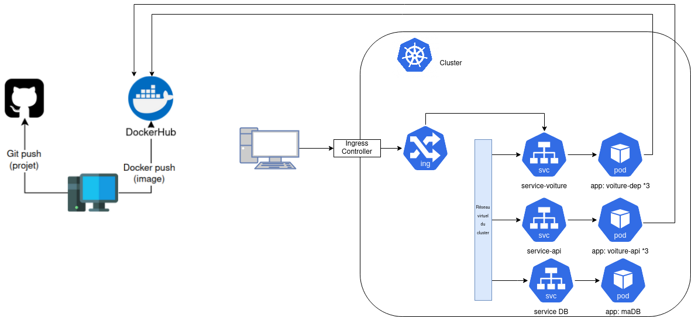

# Objectif 
- Deux images pour API et Public 
- Services pour API et Public et BDD 
- Ngress à la place de Ngnix comme dans le ch4

```

monkube apply -f deployment-api.yaml
monkube apply -f deployment-public.yaml
monkube apply -f service-api.yaml
# pour le service de Public et le ngress c'est le meme 

```



# Tests
```
monkube logs deployment/voiture-dep
monkube logs deployment/voiture-api

monkube exec -it voiture-dep-5495f89dbf-gsqk5 -- /bin/bash
    python
        import requests
        requests.get("http://voiture-api-svc:8080/api/users")

monkube logs deployment/voiture-dep
monkube logs deployment/voiture-api
```
