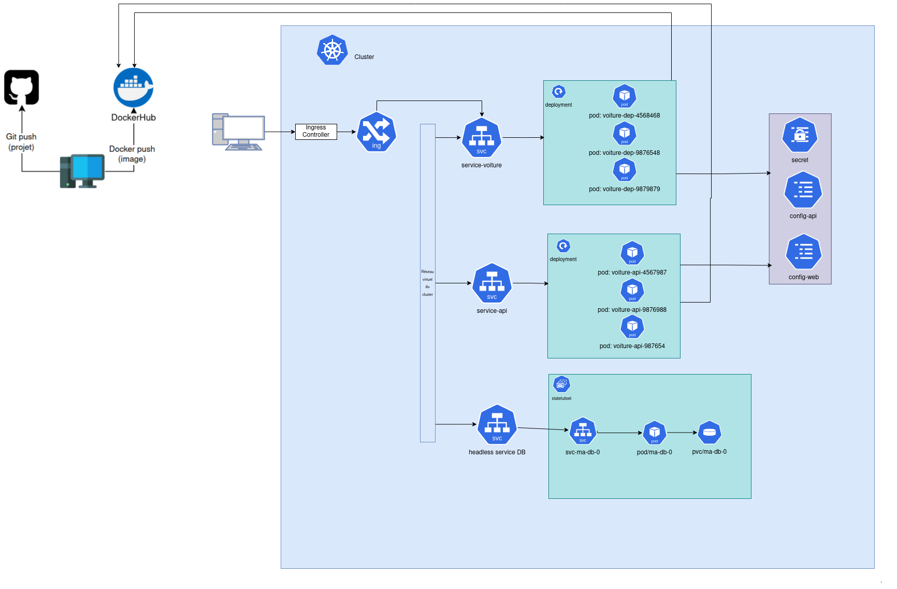

# Objectif : 
- Utiliser un StatefulSet plutôt qu'un Deployment pour déployer votre base de données Postgres
- Utiliser un Persistent Volume pour stocker le contenu de la base de données
    - Ressources : 0.1 Go
- Utiliser un service Headless plutôt qu'un service ClusterIP pour votre base de données


# Questions : 
- Quel est l'avantage d'un StatefulSet comparé à un Deployment ?
    - Nom du pod : Le StatefulSet a l'avantage de conserver le même nom de pod même si celui-ci est détruit. Un autre pod sera créé avec le même nom, le nom et le DNS seront gardé, uniquement son IP changera. (sticky identity)
    - Volumes persistants : Un StatefulSet est associé à un volume persistant. Ainsi, si le pod est supprimé, les données resteront dans le même volume et seront utilisées pour le nouveau pod créé, contrairement à un Deployment où, si le pod est supprimé, les données sont supprimées avec lui.
    - Suppression des pods : Le StatefulSet bénéficie d'une suppression séquentielle, soit dans l'ordre croissant, soit dans l'ordre décroissant, alors que le Deployment effectue la suppression en même temps pour tous les pods.

- Dans quel cas utilise-t-on un StatefulSet ?
    - Le StatefulSet est utilisé pour des bases de données nécessitant un volume persistant, ou pour des applications fonctionnant en cluster.

- C'est quoi un service Headless ?
    - Un service Headless, comme son nom l'indique, n'a pas d'IP. Il redirige donc les requêtes vers le service de chaque Pod d'un StatefulSet, qui, quant à lui, garde le même DNS. Il fonctionne avec un label, mais n'a pas d'adresse IP.


# Schéma


# commande utile
```
monkube delete all --all
monkube get pvc
monkube delete pvc/...

```